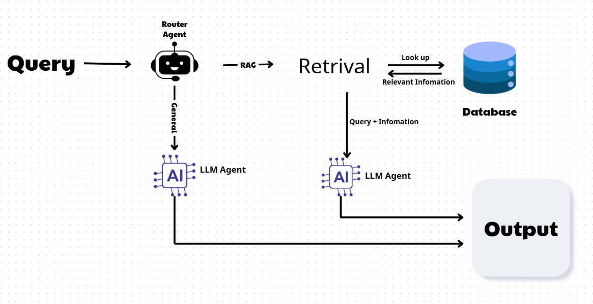

# 🚀 ProPTIT Chatbox - NeoRAG Cup 2025

## 📋 Giới thiệu

ProPTIT Chatbox là hệ thống RAG (Retrieval-Augmented Generation) thông minh được phát triển cho cuộc thi **NeoRAG Cup 2025** do Team AI (CLB Lập trình PTIT) tổ chức. Hệ thống sử dụng kiến trúc multi-agent để cung cấp thông tin chính xác về Câu lạc bộ Lập trình ProPTIT.

## ✨ Tính năng chính

- 🤖 **Multi-Agent Architecture**: Sử dụng Google-ADK để điều hướng sử dụng các agent : General Agent, RAG AgentAgent
- 🔍 **Vector Search**: Tìm kiếm semantic với MongoDB Atlas
- 🧠 **Smart Routing**: Tự động phân loại câu hỏi RAG vs General
- 📚 **Document Retrieval**: Truy xuất thông tin từ tài liệu CLB ProPTIT
- 🔄 **Query Transformation**: Tối ưu hóa câu truy vấn
- 📊 **Comprehensive Evaluation**: Metrics đánh giá hiệu suất toàn diện


## 🏗️ Kiến trúc hệ thống



## 🛠️ Cài đặt

### Prerequisites
- Python 3.12+
- MongoDB Atlas
- Google Gemini API Key
- OpenAI API Key

### Installation
```bash
git clone <repository-url>
cd ProPTIT-Chatbox
pip install -r requirements.txt
```

### Environment Setup
Tạo file `.env`:
```env
MONGODB_URI=your_mongodb_connection_string
GEMINI_API_KEY=your_gemini_api_key
OPEN_AI_KEY=your_open_api_keykey
```


## 📊 Metrics đánh giá

- **Retrieval Metrics**: Precision@k, Recall@k, NDCG@k, MRR@k
- **Generation Metrics**: ROUGE-L, BLEU-4
- **LLM-judged Metrics**: Context Precision, Context Recall
- **End-to-end Metrics**: Answer Relevancy, Faithfulness

## 🔧 Cấu hình

### Vector Database
- **Database**: MongoDB Atlas
- **Embedding Model**: Gemini Embedding 001
- **Index**: vector_index
- **Top-k**: 3,5,7 documents

### Models
- **Router**: LLM-based query classification
- **Generator**: Context-aware answer generation
- **Embedder**: Google Gemini Embedding API

## 🤝 Đóng góp

1. Fork repository
2. Tạo feature branch (`git checkout -b feature/AmazingFeature`)
3. Commit changes (`git commit -m 'Add AmazingFeature'`)
4. Push to branch (`git push origin feature/AmazingFeature`)
5. Tạo Pull Request

## 📝 License

Distributed under the MIT License. See `LICENSE` for more information.

## 👥 Team

**NeoRAG Cup 2025 Participant**
- Developer: Nguyễn Văn Minh LựcLực
- Organization: CLB Lập trình PTIT


⭐ **Star this repo if you found it helpful!**
